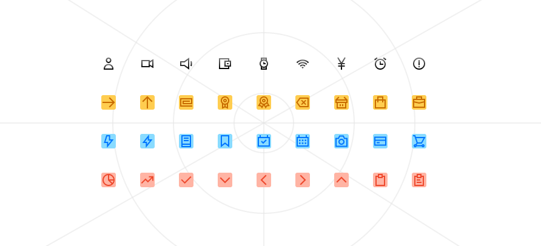

# ✨ Sparkle Remix Icons

<div align="center">

</div>

A massive collection of **1000+ SVG icons** designed to be minimalist, consistent, and easy to use in any web project or on Blogger. (We are still developing the rest of the icons)

---

## 🚀 Features
* **1000+ Icons:** A massive expansion based on the geometric aesthetic of Remix Icon.
* **Full Optimization:** Clean and lightweight SVG files.
* **Blogger Compatibility:** Includes ready-to-use code with `<b:includable>`.
* **Multi-format:** Copy SVG or HTML code, or download the file directly from the catalog.

---

## 📦 Installation and Usage

### For Web Developers
You can use the icons directly via HTML tags:
```html
<i data-i="alarm-clock"></i>
```

---

## For Blogger Users
Copy the `blogger-icons.xml` file located in the `/dist` folder and paste it into your template before `</b:defaultmarkupserver>`. Then, call them like this:

```html
<b:include name='i:sparkkle-remix' data='{ icon: "adobe" }'/>
```

---

## 🛠️ Local Development
If you want to run the catalog on your machine:

### Install dependencies:

`npm install`

---

### Environment Variable Setup:
Create a `.env.local` file and add your `GEMINI_API_KEY` (if you are using advanced AI search features).

---

### Run the site:

`npm run dev`

---

## 📜 License and Attribution
This project is a derivative work and expansion of Remix Icon.

* Original Icons and Expansion: Apache 2.0 License.

* Expansion Author: Dimas Gómez.

Made with ❤️ in Colombia by dimas-a-gomez.
